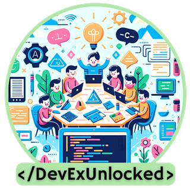

# DevEx Unlocked

Here you will find the links showed during the DevEx Unlocked event.
This event took place from 11/19/2024 until 12/12/2024 where eight sessions were delivered in Portuguese and Spanish about developer experience.

Feel free to use it! ❤️

## S01: How DevEx makes developers more happy and productive

1. [Developer experience: What is it and why should you care?](https://github.blog/enterprise-software/collaboration/developer-experience-what-is-it-and-why-should-you-care/)
2. [Engineering Fundamentals Playbook - Developer Experience (DevEx)](https://microsoft.github.io/code-with-engineering-playbook/developer-experience/)
3. [Set up your development environment on Windows](https://learn.microsoft.com/en-us/windows/dev-environment/)
4. [Sample DSC configurations for Dev Home](https://github.com/microsoft/devhome/tree/main/docs/sampleConfigurations)
5. [Windows Terminal](https://github.com/microsoft/terminal)
6. [Nerd Fonts](https://www.nerdfonts.com/)
7. [PowerShell](https://github.com/PowerShell/PowerShell)
8. [Dev Home](https://github.com/microsoft/devhome)
9. [WinGet](https://github.com/microsoft/winget-cli)
10. [Oh My Posh](https://ohmyposh.dev/)
11. [Visual Studio Code](https://code.visualstudio.com/)
12. [Windows Subsystem for Linux](https://learn.microsoft.com/en-us/windows/wsl/)
13. [My Ultimate PowerShell prompt with Oh My Posh and the Windows Terminal by Scott Hanselman](https://www.hanselman.com/blog/my-ultimate-powershell-prompt-with-oh-my-posh-and-the-windows-terminal)

## S02: Be more productive and faster than ever with GitHub Copilot

1. [The world most widely adopted AI dev tool](https://github.com/features/copilot)
2. [GitHub Copilot Tips and Tricks](https://www.youtube.com/watch?v=1qs6QKk0DVc&ab_channel=GitHub)
3. [Quantifying GitHub Copilot’s impact on developer productivity and happiness](https://github.blog/news-insights/research/research-quantifying-github-copilots-impact-on-developer-productivity-and-happiness/)
4. [GitHub Universe](https://githubuniverse.com/)
5. [GitHub Copilot On-Demand Sessions](https://reg.githubuniverse.com/flow/github/universe24/attendee-portal/page/sessioncatalog?search.deliveryformat=1692799009854004CQlx&search.githubproduct=1681323318975006zEYH)

## S03: MythBusters: is it true that modern apps make me more productive?

1. [Big Ball of Mud](https://deviq.com/antipatterns/big-ball-of-mud)
2. [What is Cloud Native?](https://learn.microsoft.com/en-us/dotnet/architecture/cloud-native/definition)
3. [The Twelve-Factor App](https://12factor.net/)
4. [Azure Well-Architected Framework](https://learn.microsoft.com/en-us/azure/well-architected/)
5. [Feature Flags](https://martinfowler.com/articles/feature-toggles.html)
6. [Azure App Configuration](https://learn.microsoft.com/en-us/azure/azure-app-configuration/overview)
7. [Semantic Versioning](https://semver.org/)
8. [Release Flow: How We Do Branching on the VSTS Team - Azure DevOps Blog](https://devblogs.microsoft.com/devops/release-flow-how-we-do-branching-on-the-vsts-team/)
9. [KEDA](https://keda.sh/)
10. [Dapr](https://dapr.io/)
11. [Radius](https://radapp.io/)
12. [.NET Aspire](https://learn.microsoft.com/en-us/dotnet/aspire/get-started/aspire-overview)
13. [eShop Reference Application](https://github.com/dotnet/eshop)

## S04: Move your workstation to the cloud with Microsoft Dev Box

1. [Microsoft Dev Box](https://learn.microsoft.com/en-us/azure/dev-box/)
2. [Pricing](https://azure.microsoft.com/en-us/pricing/details/dev-box)
3. [Customizations](https://learn.microsoft.com/en-us/azure/dev-box/concept-what-are-team-customizations)

## S05: Where is my CPU and memory? Using Azure Monitor Code Optimizations to identify hotspots.
1. [Code Optimizations repo for testing and demo purposes.](https://github.com/jkalis-MS/CodeOptimizationsSampleApp/tree/main)
2. [Code Optimization Overview.](https://learn.microsoft.com/en-us/azure/azure-monitor/insights/code-optimizations)
3. [Azure Well-Architected Framework.](https://learn.microsoft.com/en-us/azure/well-architected/)
4. [Code Optimizations Extension.](https://learn.microsoft.com/en-us/azure/azure-monitor/insights/code-optimizations-vscode-extension)

## S06: Developing applications in the cloud using GitHub Codespaces.
1. [Github CodeSpaces Overview.](https://docs.github.com/en/codespaces/overview)
2. [Understand the cost](https://github.com/pricing/calculator)
3. [Github CodeSpaces Quickstart](https://docs.github.com/en/codespaces/getting-started/quickstart)
4. [Github CodeSpaces Repo Demo] (https://github.com/github/copilot-codespaces-demo)
   
## S07: Is Kubernetes hard? Here is the solution: AKS Automatic!
1. [What is AKS Automatic?](https://learn.microsoft.com/en-us/azure/aks/intro-aks-automatic)
2. [Features compartion between AKS Automatic and AKS Standard](https://learn.microsoft.com/en-us/azure/aks/intro-aks-automatic#aks-automatic-and-standard-feature-comparison)
3. Deploy AKS Automatic:
    * [Using Azure Portal](https://learn.microsoft.com/en-us/azure/aks/learn/quick-kubernetes-automatic-deploy?pivots=azure-portal)
    * [Using Azure CLI](https://learn.microsoft.com/en-us/azure/aks/learn/quick-kubernetes-automatic-deploy?pivots=azure-cli)
    * [Using Bicep Template](https://learn.microsoft.com/en-us/azure/aks/learn/quick-kubernetes-automatic-deploy?pivots=bicep)
5. [Get access to AKS Automatic](https://learn.microsoft.com/en-us/azure/aks/enable-authentication-microsoft-entra-id#access-your-enabled-cluster)
6. [Demo App to test AKS Automatic](https://github.com/oaviles/hello_cloud-native)

## S08: Don’t be pwned, use GitHub Advanced Security
1. [GitHub Advanced Security - Code Scanning](https://docs.github.com/en/code-security/code-scanning/introduction-to-code-scanning/about-code-scanning)
2. [GitHub Advanced Security - Secret Scanning](https://docs.github.com/en/code-security/secret-scanning/introduction/about-secret-scanning)
3. [CodeQL](https://github.com/github/codeql)
4. [OWASP Juice Shop](https://owasp.org/www-project-juice-shop/)
5. [OWASP Top Ten](https://owasp.org/www-project-top-ten/)
6. [OWASP Mobile Top Ten](https://owasp.org/www-project-mobile-top-10/)
7. [OWASP API Security](https://owasp.org/www-project-api-security/)
8. [MITRE ATT&CK](https://attack.mitre.org/)

